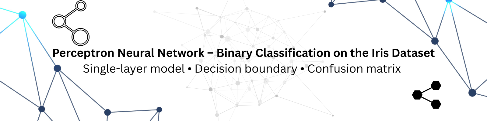

# Perceptron Neural Network – Binary Classification on Iris Dataset 🌸

<p align="center">
  
</p>

Binary classification of Iris flowers using a Perceptron model with clear decision boundary visualization and confusion matrix.  

This mini project is part of my continuous practice in Machine Learning and basic Deep Learning concepts, implemented and documented with a clean Jupyter Notebook and visual outputs.

---

## 🔍 Visual Story

A quick visual overview of what this project does.

<p align="center">
  
  
</p>

<p align="center">
  
</p>

These visuals show how the Perceptron separates two Iris classes in 2D feature space and how well it performs on the test data.

---

## 📘 What this project demonstrates

- Implementation of a **Perceptron** model for binary classification on the classic Iris dataset.
- Understanding Perceptron as a **basic Artificial Neural Network (ANN)** concept inside the broader Deep Learning and Machine Learning field.
- Visualizing the learned decision boundary in 2D feature space.
- Evaluating model performance using a confusion matrix and accuracy.

---

## 📂 Project Overview

- Problem type: **Binary classification** using two Iris species.
- Algorithm used: **Perceptron Neural Network** single-layer with a linear decision boundary.
- Input features: Two numerical features selected from the Iris dataset for 2D visualization.
- Outputs: decision boundary plot, confusion matrix heatmap, and a step-by-step notebook workflow.

---

## 📊 Dataset

- Dataset used: **Iris dataset**.
- Task setup: Converted from multi-class to binary classification by selecting two classes.
- Features: Two numerical features chosen for visualizing class separation.
- Preprocessing steps: data selection, class filtering, and train-test split.

---

## 🧠 Notebook Workflow

The main notebook in this repository is:

- `Binary Classification of Iris Flowers Using Perceptron Algorithm.ipynb`

Inside the notebook, you will find:

1. **Introduction & Problem Setup**
- Overview of the Iris dataset and binary classification objective.
- Short explanation of the Perceptron model.

2. **Data Loading & Exploration**
- Load the Iris dataset.
- Filter for two target classes.
- Select two features for 2D visualization.
- Create basic plots to understand class separation.

3. **Data Preparation**
- Perform train-test split.
- Apply preprocessing steps if required for model training.

4. **Perceptron Model Training**
- Initialize and train the Perceptron model.
- Observe convergence and classification behavior.

5. **Visualization**
- Plot the Iris data points in 2D feature space.
- Plot the learned decision boundary.
- Display the confusion matrix.

6. **Evaluation & Insights**
- Compute model accuracy.
- Interpret the confusion matrix.
- Discuss the model’s classification behavior.

---

## 📈 Model Performance

- Task: Binary classification on a subset of the Iris dataset.
- **Accuracy**: The model achieved **100%** accuracy on the test data.
- **Confusion Matrix**: Included above in the Visual Story section.

This result shows that the selected two classes are linearly separable in the chosen feature space, making them a strong fit for a Perceptron-based classifier.

---

## 🧩 What I practiced in this project

- Working with the Iris dataset for binary classification.
- Implementing a Perceptron Neural Network from a practical learning perspective.
- Understanding how a linear decision boundary separates classes.
- Interpreting model performance through a confusion matrix.
- Creating visual explanations for classification results.
- Structuring and documenting an ML mini project for GitHub.

---

## ⚙️ How to run this notebook

1. **Clone the repository**

```bash
git clone https://github.com/adiratna89/Perceptron-Neural-Network-Binary-Classification.git
cd Perceptron-Neural-Network-Binary-Classification
```

2. **Create/activate a Python environment** (optional but recommended).

3. **Install required libraries**

```bash
pip install numpy pandas matplotlib seaborn scikit-learn
```

4. **Open the notebook**

```bash
jupyter notebook "Binary Classification of Iris Flowers Using Perceptron Algorithm.ipynb"
```

Run the cells step by step to reproduce the results and visualizations.

---

## 🧭 Future improvements

- Implement a **Multi-Layer Perceptron (MLP)** and compare it with the single-layer Perceptron.
- Try different feature combinations from the Iris dataset and compare the decision boundaries.
- Add cross-validation and more evaluation metrics such as precision, recall, and F1-score.
- Compare Perceptron with classifiers like Logistic Regression, SVM, or k-NN.
- Extend this project into a broader Deep Learning practice series.

---

## 📁 Repository Structure

```text
Perceptron-Neural-Network-Binary-Classification/
│
├── Binary Classification of Iris Flowers Using Perceptron Algorithm.ipynb
├── README.md
├── LICENSE
└── Output_Images/
    ├── Perceptron_Banner.png
    ├── Iris Dataset - Binary Classification.png
    ├── Decision Boundary.png
    └── Confusion Matrix - Perceptron.png
```

This structure keeps the notebook, documentation, banner, and output visuals organized and easy to navigate.

---

## 👤 Author

**Adiratna Kamble**

- GitHub: [adiratna89](https://github.com/adiratna89)
- LinkedIn: [linkedin.com/in/adiratna-kamble](https://www.linkedin.com/in/adiratna-kamble)
- Email: adi8976839010@gmail.com

This mini project reflects my continuous hands-on practice in Python, Machine Learning, and Deep Learning fundamentals, along with my effort to improve project presentation on GitHub.

---

## 📄 License

This project is licensed under the **MIT License**.  
You are welcome to use or refer to this repository for learning purposes.
